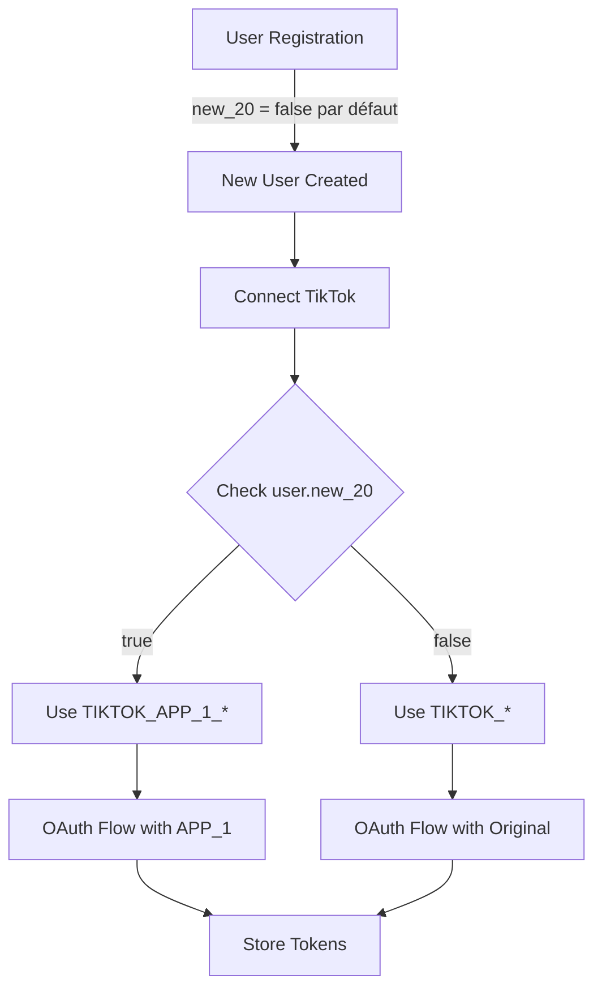

# Plan : Arrêter d'utiliser new_20 pour les nouveaux utilisateurs

## Objectif
Conserver la logique multi-app TikTok existante, mais arrêter de définir `new_20=true` pour les nouveaux utilisateurs. Les utilisateurs existants avec `new_20=true` continueront d'utiliser `TIKTOK_APP_1_*`, tandis que les nouveaux utilisateurs (avec `new_20=false` par défaut) utiliseront les credentials originaux `TIKTOK_CLIENT_KEY`.

## Modifications à effectuer

### 1. Controller d'inscription
- **Fichier** : `back/src/controllers/auth/register.controller.ts`
  - Supprimer `new_20: true` lors de la création d'un utilisateur (ligne 93)
  - Le champ utilisera la valeur par défaut `false` définie dans le schéma
  - Garder `new_20` dans le type `AuthUser` retourné (car il existe toujours dans la base)

## Ce qui reste inchangé

- Le champ `new_20` reste dans le schéma de base de données (pas de migration de suppression)
- La logique multi-app dans `tiktokService` reste intacte (getConfig avec useApp1, etc.)
- Tous les controllers qui utilisent `new_20` pour déterminer quelle app utiliser restent inchangés
- Les types `AuthUser` gardent le champ `new_20`
- Les utilisateurs existants avec `new_20=true` continuent d'utiliser `TIKTOK_APP_1_*`

## Résultat

- **Utilisateurs existants avec `new_20=true`** : Continuent d'utiliser `TIKTOK_APP_1_CLIENT_KEY` (l'app nouvellement approuvée)
- **Nouveaux utilisateurs (après ce changement)** : Utilisent `TIKTOK_CLIENT_KEY` (credentials originaux) car `new_20=false` par défaut

## Architecture

